# EliteShop – Full Stack MERN Ecommerce Platform

EliteShop is a full-stack ecommerce marketplace platform built using the MERN stack. It includes customer, seller, and admin workflows with product browsing, category-based shopping, wishlist, cart, checkout, order management, seller approval, product management, Cloudinary image uploads, Razorpay payment integration, and role-based dashboards.

This project was developed to simulate a real-world ecommerce platform and demonstrate practical full-stack development skills using React.js, Node.js, Express.js, MongoDB, JWT authentication, Cloudinary, and Razorpay.

---

## Live Demo

The project is currently not deployed online.

Demo videos are available below.

---

## Demo Videos

A walkthrough of the main EliteShop workflows including customer, seller, and admin dashboards.

| Module           | Video                                                       |
| ---------------- | ----------------------------------------------------------- |
| Admin Dashboard  | [Watch Admin Dashboard Demo](https://youtu.be/Og0ETEyda44)  |
| User Dashboard   | [Watch User Dashboard Demo](https://youtu.be/ZY0gr87aerg)   |
| Seller Dashboard | [Watch Seller Dashboard Demo](https://youtu.be/xrwNxnk9fq8) |

---


### Screenshots

### Homepage

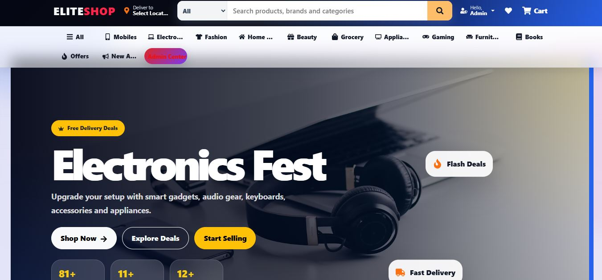

### Product Listing and Homepage Sections

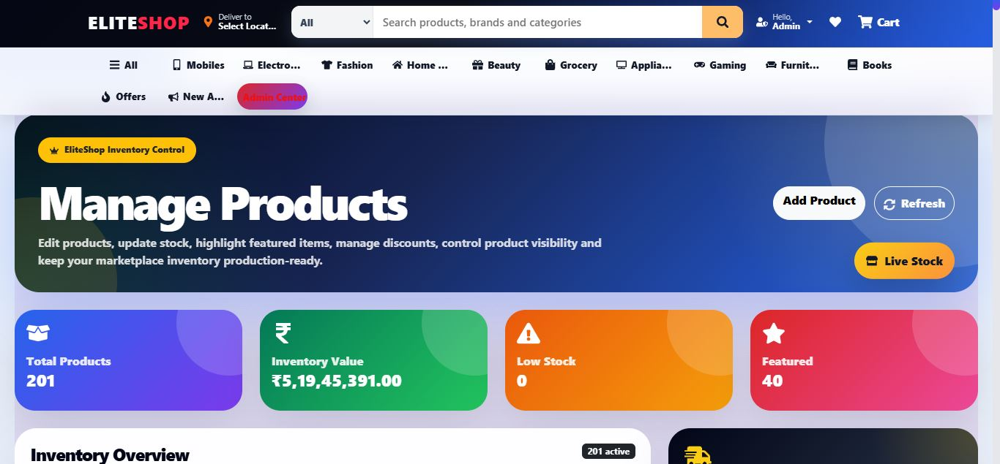

### Product Management View

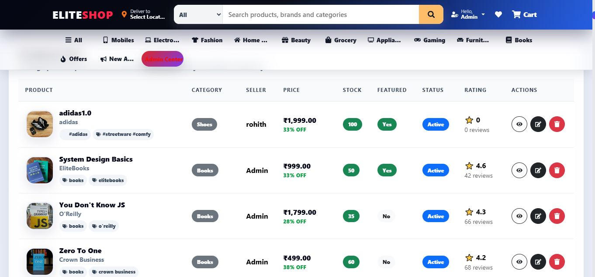

### Cart Page

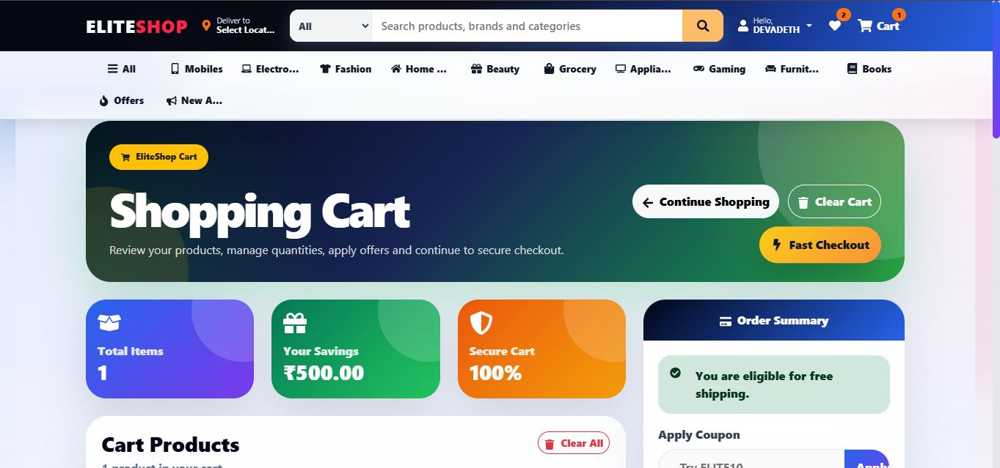

### Shopping Cart Overview

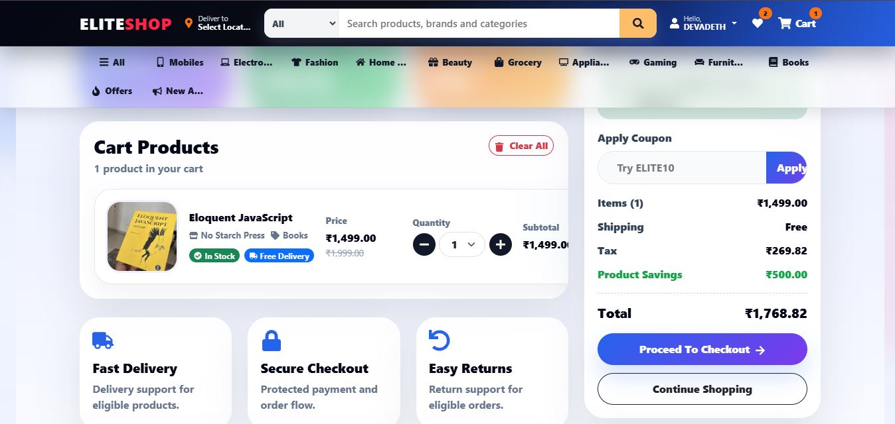

### Shipping Address Page


### Delivery Information Form


### Delivery Mode and Address Details


### Payment Selection Page

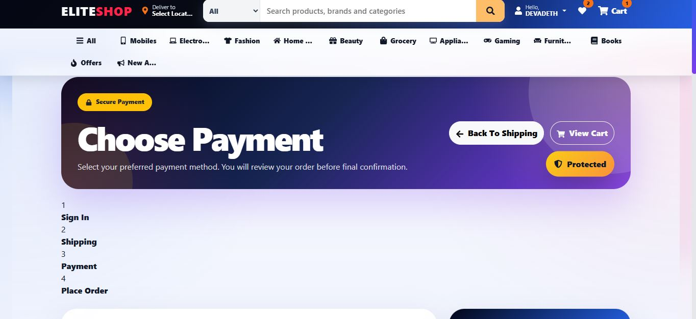

### Payment Summary Page

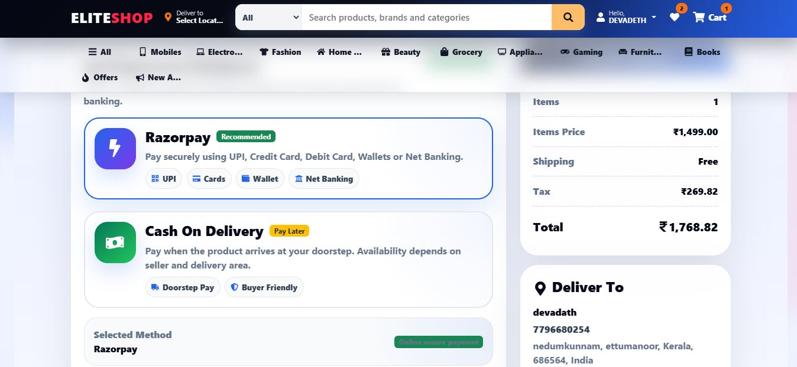

### Razorpay Payment Gateway

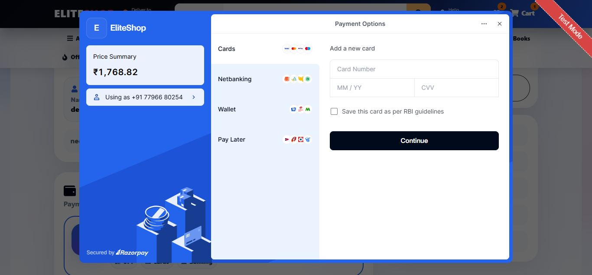

### User Dashboard


### Seller Dashboard

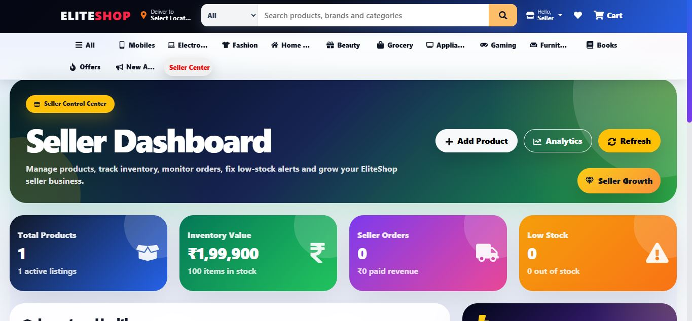

### Seller Inventory View

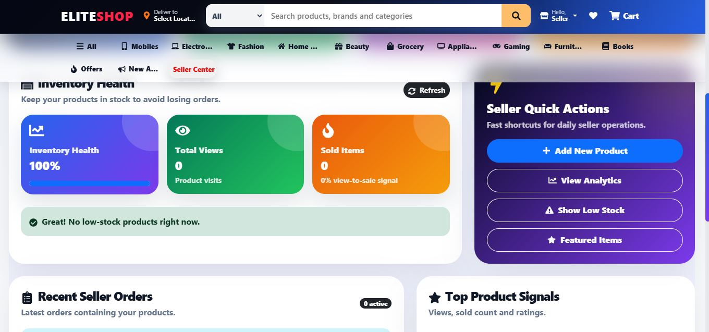

### Seller Product Management

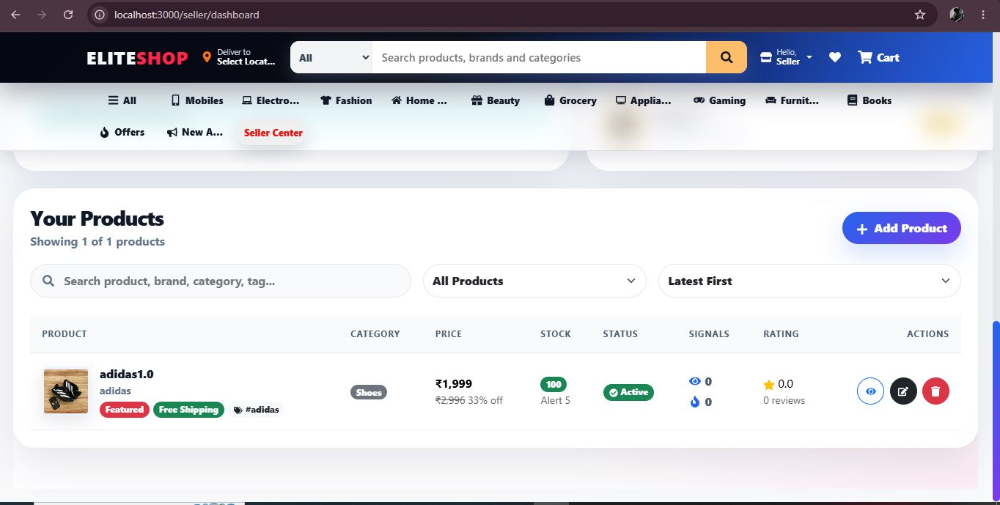

### Seller Analytics

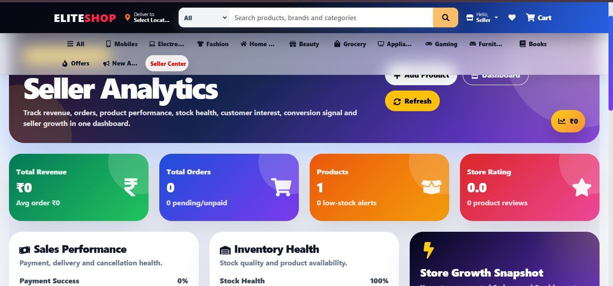

### Admin Dashboard

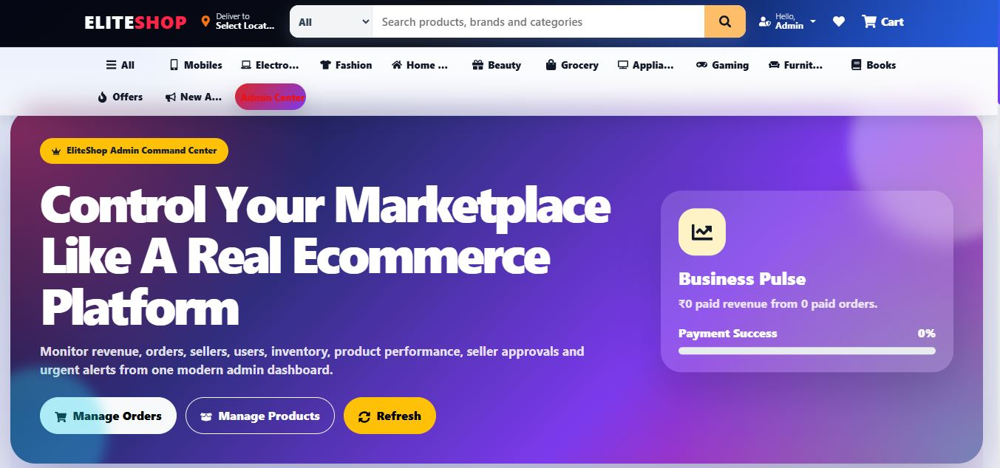

### Admin Marketplace Overview

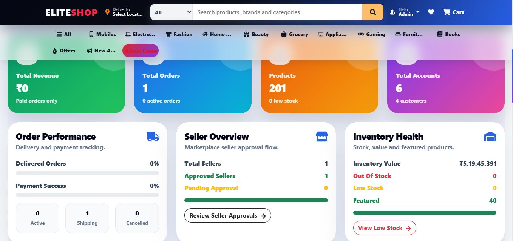

### Admin Business Control

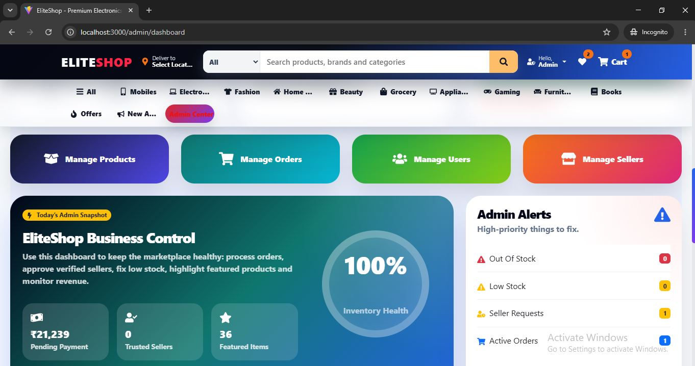

### Admin Recent Orders and Products

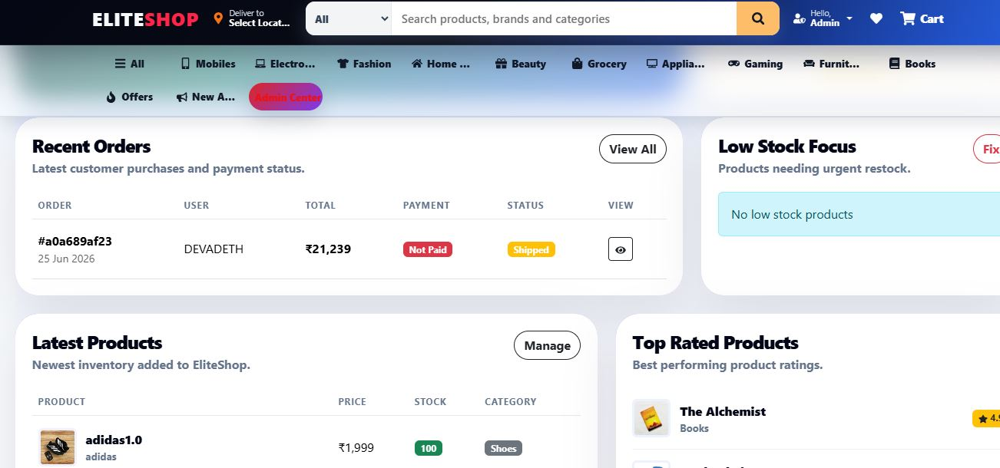

### Admin Additional Dashboard View

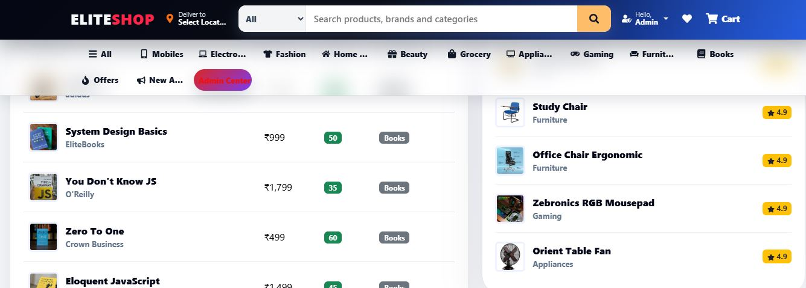

### Admin Order Management

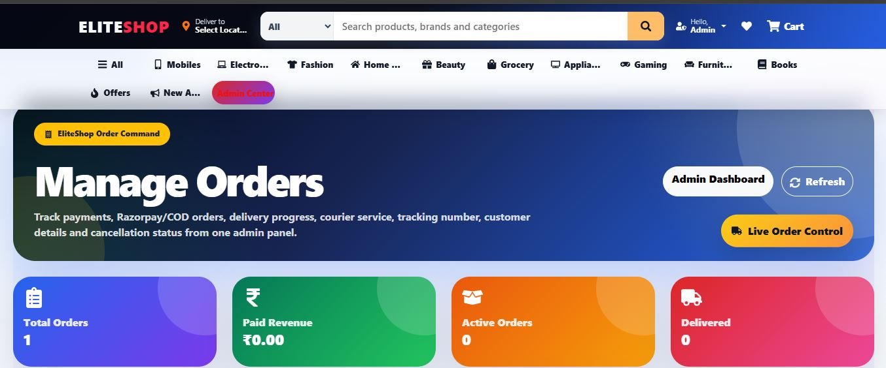

### Admin User Management

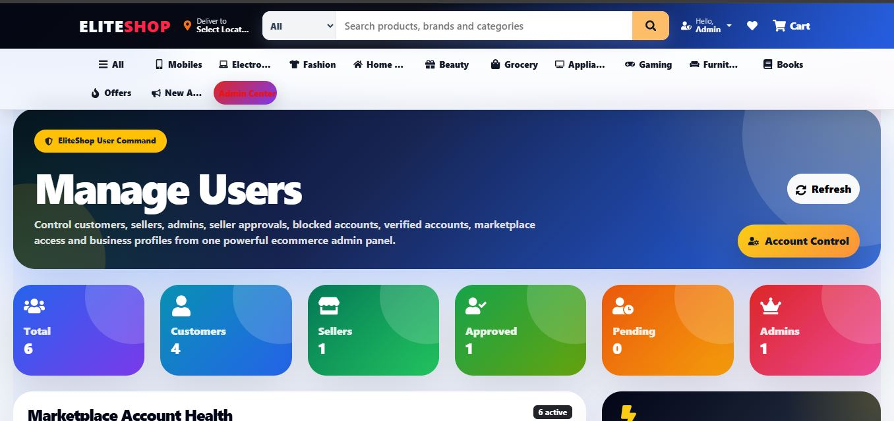

### Admin User Management View 2

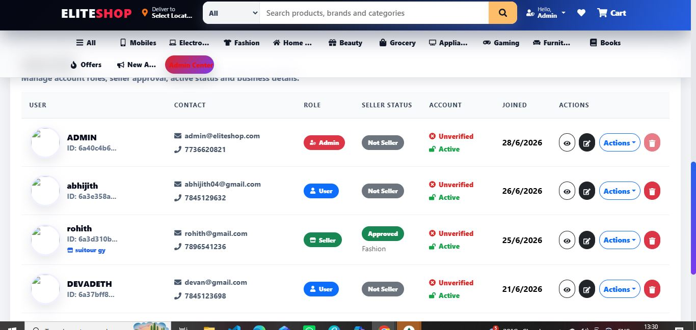

### Footer


---

## Project Overview

EliteShop is designed with three main user roles:

* Customer
* Seller
* Admin

Customers can browse products, view product details, add items to cart, manage wishlist, enter shipping information, choose payment method, place orders, and use Razorpay for online payment.

Sellers can register, wait for admin approval, access a dedicated seller dashboard, add products, manage inventory, track product performance, and view seller analytics.

Admins can manage the entire marketplace including users, sellers, products, orders, inventory health, seller approvals, and business performance from a dedicated admin dashboard.

---

## Key Features

### Customer Features

* Customer registration and login
* JWT-based authentication
* Product browsing by category
* Product details page
* Product search support
* Wishlist management
* Shopping cart
* Quantity update in cart
* Coupon input UI
* Shipping address flow
* Payment method selection
* Razorpay payment integration
* Cash on delivery option
* Order placement
* Order summary
* Customer dashboard

### Seller Features

* Seller registration
* Seller approval pending page
* Seller dashboard
* Add product
* Edit product
* Delete product
* Product image upload
* Product inventory management
* Low stock monitoring
* Seller analytics
* Product performance signals
* Seller quick actions

### Admin Features

* Admin dashboard
* User management
* Seller management
* Seller approval workflow
* Product management
* Order management
* Inventory health monitoring
* Low stock tracking
* Featured product tracking
* Revenue and order overview
* Marketplace business control
* Role-based route protection

### Product and Image Features

* Category-based product sections
* Product cards with image, price, rating, discount, and stock
* Featured product badges
* Product filtering and sorting support
* Product image upload
* Cloudinary image storage
* Product image seeding support

### Order and Payment Features

* Cart management
* Checkout workflow
* Shipping details form
* Delivery mode selection
* Payment method selection
* Razorpay payment gateway
* Cash on delivery option
* Order status tracking
* Admin order management

---

## Tech Stack

### Frontend

* React.js
* Vite
* React Router DOM
* React Bootstrap
* Bootstrap
* CSS
* Axios
* Framer Motion
* React Icons
* React Toastify
* Context API

### Backend

* Node.js
* Express.js
* MongoDB
* Mongoose
* JWT Authentication
* bcrypt.js
* Cloudinary
* Multer
* Razorpay
* dotenv
* cookie-parser
* cors

### Database

* MongoDB
* Mongoose Models

### Image Storage

* Cloudinary

### Payment Gateway

* Razorpay

---

## Folder Structure

```txt
eliteshop
├── assets
│   └── screenshots
│       ├── admin-homepage.jpg
│       ├── admin-manage-order.jpg
│       ├── admin-manage-product-1.jpg
│       ├── admin-manage-product.jpg
│       ├── admin-manage-user-1.jpg
│       ├── admin-manage-user.jpg
│       ├── admin1.jpg
│       ├── admin2.jpg
│       ├── admin3.jpg
│       ├── admin4.jpg
│       ├── admin5.jpg
│       ├── footer.jpg
│       ├── seller-analytics.jpg
│       ├── seller-dashboard-1-.jpg
│       ├── seller-dashboard-2-.jpg
│       ├── seller-dashboard.jpg
│       ├── user-cart-1.jpg
│       ├── user-cartpage.jpg
│       ├── user-dashboard.jpg
│       ├── user-ordering page 1.jpg
│       ├── user-ordering page 2.jpg
│       ├── user-ordering page.jpg
│       ├── user-payement-page.jpg
│       ├── user-payement-page1.jpg
│       └── user-razorpay.jpg
│
├── backend
│   ├── config
│   │   ├── cloudinary.js
│   │   └── db.js
│   │
│   ├── controllers
│   │   ├── cartController.js
│   │   ├── orderController.js
│   │   ├── productController.js
│   │   └── userController.js
│   │
│   ├── data
│   │   ├── sampleProducts.js
│   │   └── users.js
│   │
│   ├── middleware
│   │   ├── asyncHandler.js
│   │   ├── authMiddleware.js
│   │   ├── checkObjectId.js
│   │   ├── errorMiddleware.js
│   │   └── uploadMiddleware.js
│   │
│   ├── models
│   │   ├── cartModel.js
│   │   ├── orderModel.js
│   │   ├── productModel.js
│   │   └── userModel.js
│   │
│   ├── routes
│   │   ├── cartRoutes.js
│   │   ├── orderRoutes.js
│   │   ├── productRoutes.js
│   │   ├── uploadRoutes.js
│   │   └── userRoutes.js
│   │
│   ├── scripts
│   │   ├── createAdmin.js
│   │   └── uploadProductImages.js
│   │
│   ├── utils
│   │   ├── calcPrices.js
│   │   ├── generateToken.js
│   │   └── razorpay.js
│   │
│   ├── seeder.js
│   └── server.js
│
├── frontend
│   ├── public
│   │
│   ├── src
│   │   ├── components
│   │   ├── context
│   │   ├── pages
│   │   │   ├── admin
│   │   │   ├── seller
│   │   │   └── user
│   │   ├── styles
│   │   ├── utils
│   │   ├── App.jsx
│   │   └── main.jsx
│   │
│   ├── index.html
│   ├── package.json
│   └── vite.config.js
│
├── .gitignore
├── package.json
└── README.md
```

---

## Environment Variables

Create a `.env` file inside the `backend` folder.

```env
PORT=5000
NODE_ENV=development
MONGO_URI=your_mongodb_connection_string
JWT_SECRET=your_jwt_secret

CLOUDINARY_CLOUD_NAME=your_cloudinary_cloud_name
CLOUDINARY_API_KEY=your_cloudinary_api_key
CLOUDINARY_API_SECRET=your_cloudinary_api_secret

RAZORPAY_KEY_ID=your_razorpay_key_id
RAZORPAY_KEY_SECRET=your_razorpay_key_secret
```

Create a `.env` file inside the `frontend` folder.

```env
VITE_API_URL=http://localhost:5000/api
VITE_RAZORPAY_KEY_ID=your_razorpay_key_id
```

Important: Real `.env` files are ignored using `.gitignore` and should not be pushed to GitHub.

---

## Installation and Setup

### 1. Clone the Repository

```bash
git clone https://github.com/abhijithak04/eliteshop.git
cd eliteshop
```

### 2. Backend Setup

```bash
cd backend
npm install
npm start
```

Backend runs on:

```txt
http://localhost:5000
```

### 3. Frontend Setup

Open a new terminal:

```bash
cd frontend
npm install
npm run dev
```

Frontend runs on:

```txt
http://localhost:3000
```

---

## Database Seeding

To insert sample users and products:

```bash
cd backend
node seeder.js
```

To delete seeded data:

```bash
node seeder.js -d
```

---

## Cloudinary Product Image Upload

Product images are uploaded to Cloudinary using a backend script.

```bash
cd backend
node scripts/uploadProductImages.js
```

The script checks product images from:

```txt
backend/seed-images/products
backend/seed-images/categories
```

Exact product images should be placed inside:

```txt
backend/seed-images/products
```

Category fallback images should be placed inside:

```txt
backend/seed-images/categories
```

---

## Main Application Workflows

### Customer Workflow

```txt
Register / Login
→ Browse Products
→ View Product Details
→ Add to Cart
→ Add to Wishlist
→ Enter Shipping Details
→ Choose Payment Method
→ Place Order
→ Pay Using Razorpay / Cash On Delivery
→ Track Order
```

### Seller Workflow

```txt
Seller Register
→ Wait for Admin Approval
→ Login as Seller
→ Access Seller Dashboard
→ Add Product
→ Upload Product Image
→ Manage Products
→ Monitor Inventory
→ View Seller Analytics
```

### Admin Workflow

```txt
Admin Login
→ View Admin Dashboard
→ Manage Users
→ Manage Sellers
→ Approve Sellers
→ Manage Products
→ Manage Orders
→ Monitor Inventory Health
→ Track Marketplace Activity
```

---

## API Modules

The backend is organized into clear API modules:

* User authentication and profile APIs
* Product APIs
* Cart APIs
* Order APIs
* Upload APIs
* Seller workflow APIs
* Admin management APIs

---

## Security Features

* JWT-based authentication
* Password hashing using bcrypt.js
* Protected routes
* Role-based access control
* Admin-only route protection
* Seller-only route protection
* Environment variables for secret keys
* Sensitive files ignored using `.gitignore`

---

## Project Highlights

* Built a complete MERN ecommerce marketplace workflow
* Implemented customer, seller, and admin role systems
* Created category-based product browsing experience
* Added cart, wishlist, checkout, and order workflow
* Integrated Razorpay payment gateway
* Added Cloudinary image upload support
* Created seller approval and seller dashboard workflow
* Built admin dashboard for marketplace control
* Added inventory monitoring and product management
* Designed responsive UI using React Bootstrap and custom CSS
* Created product seeding and image upload automation scripts

---

## What I Learned

* Full-stack MERN application development
* REST API development using Express.js
* MongoDB schema design with Mongoose
* JWT authentication and role-based authorization
* React routing and protected routes
* State management using Context API
* Cart, wishlist, and checkout workflow design
* Cloudinary image upload integration
* Razorpay payment gateway integration
* Admin and seller dashboard development
* GitHub project organization and documentation

---

## Future Improvements

* Deploy frontend and backend
* Add live demo link
* Add email notifications
* Add invoice PDF generation
* Add advanced seller analytics
* Add coupon management
* Add product review image uploads
* Add search suggestions
* Add product recommendation system
* Improve SEO and performance optimization

---

## Author

**Abhijith Kumar P A**
MERN Stack Developer

GitHub: [abhijithak04](https://github.com/abhijithak04)
