# EliteShop – Full Stack MERN Ecommerce Platform

EliteShop is a full-stack ecommerce web application built with the MERN stack. It includes customer, seller, and admin workflows with product browsing, cart, wishlist, checkout, order management, seller approval, Cloudinary image uploads, Razorpay payment integration, and role-based dashboards.

This project was built as a real-world ecommerce platform to demonstrate full-stack development skills using React, Node.js, Express.js, MongoDB, JWT authentication, Cloudinary, and Razorpay.

---

## Live Demo

>

---

## Demo Videos

A walkthrough of the main EliteShop workflows including customer, seller, and admin dashboards.

| Module           | Video                                                       |
| ---------------- | ----------------------------------------------------------- |
| Admin Dashboard  | [Watch Admin Dashboard Demo](https://youtu.be/Og0ETEyda44)  |
| User Dashboard   | [Watch User Dashboard Demo](https://youtu.be/ZY0gr87aerg)   |
| Seller Dashboard | [Watch Seller Dashboard Demo](https://youtu.be/xrwNxnk9fq8) |

---

## Screenshots

### Homepage

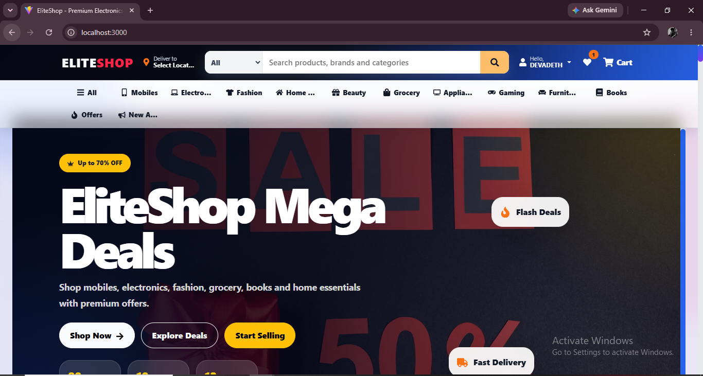

### Product Page

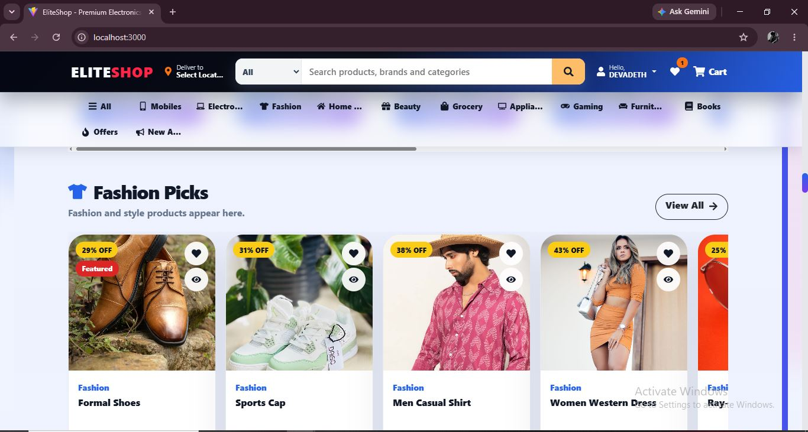

### Cart Page 1

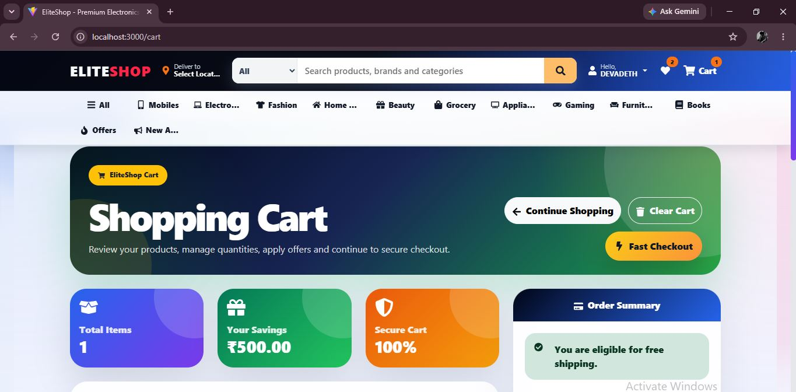

### Cart Page 2


### User Dashboard

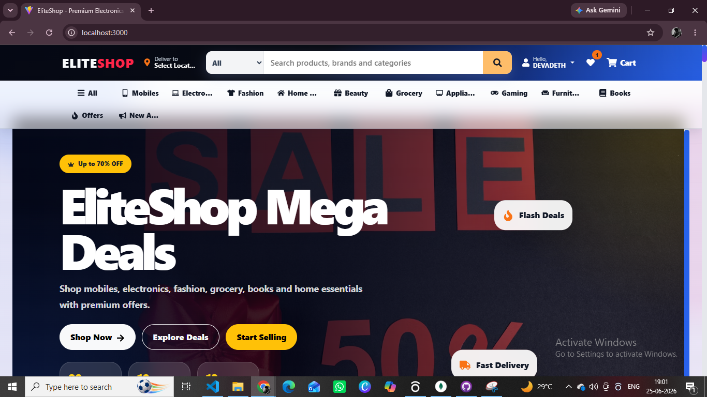

### Seller Dashboard

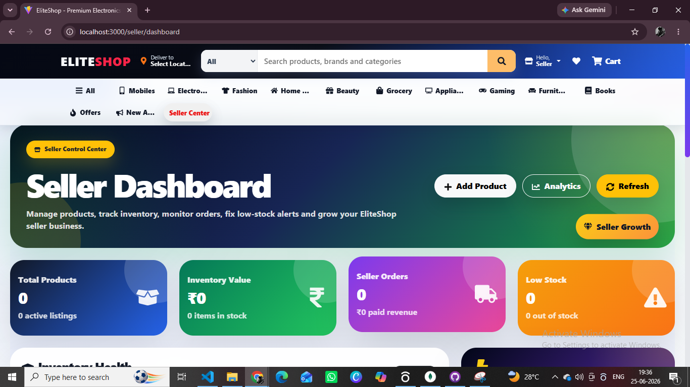

### Seller Dashboard View 1

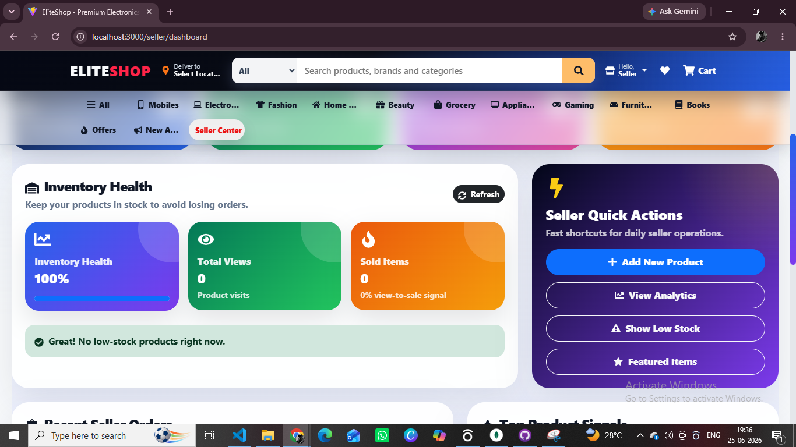

### Seller Dashboard View 2

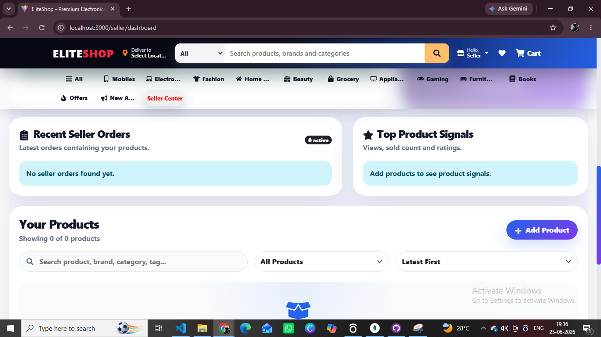

### Seller Approval Pending


### Admin Dashboard


### Admin View 1

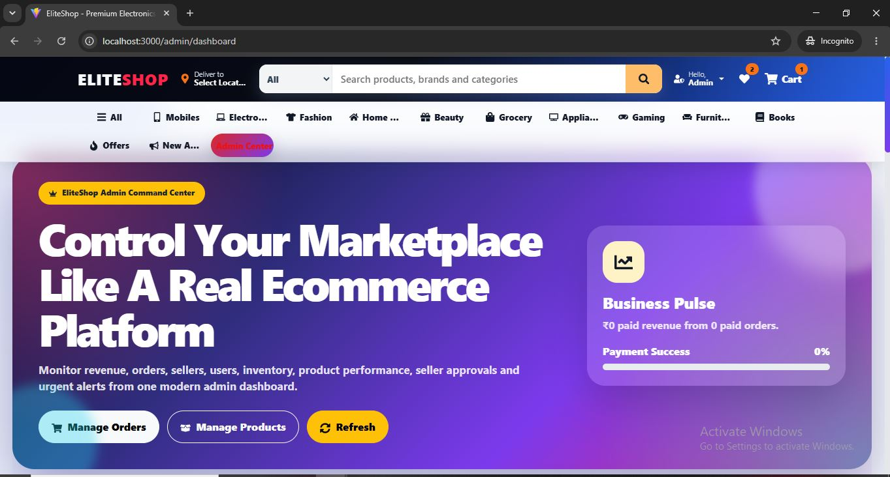

### Admin View 2

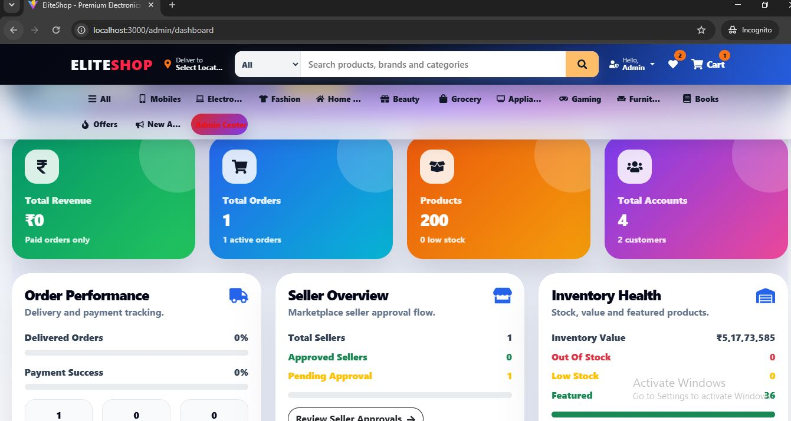

### Admin View 3


### Admin View 4

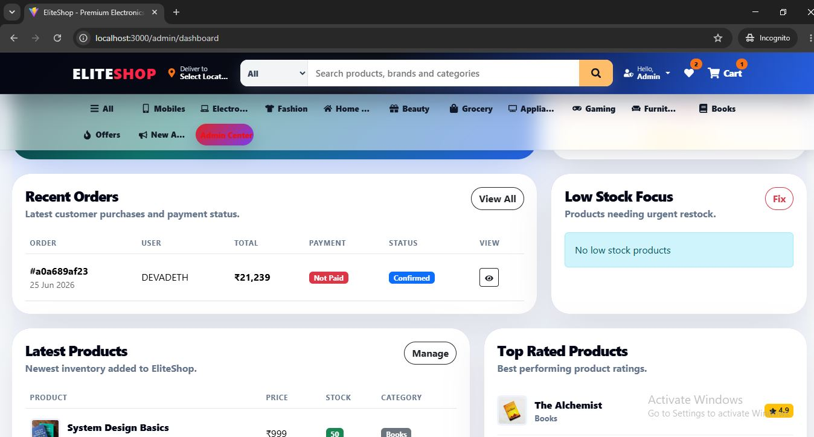

### Admin Approved Seller

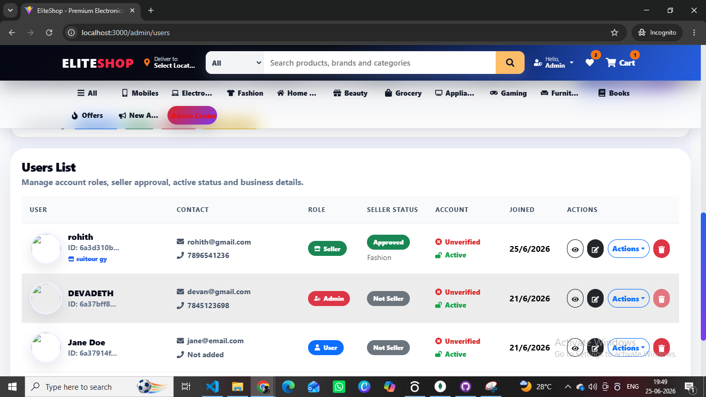

### Admin Approving Seller

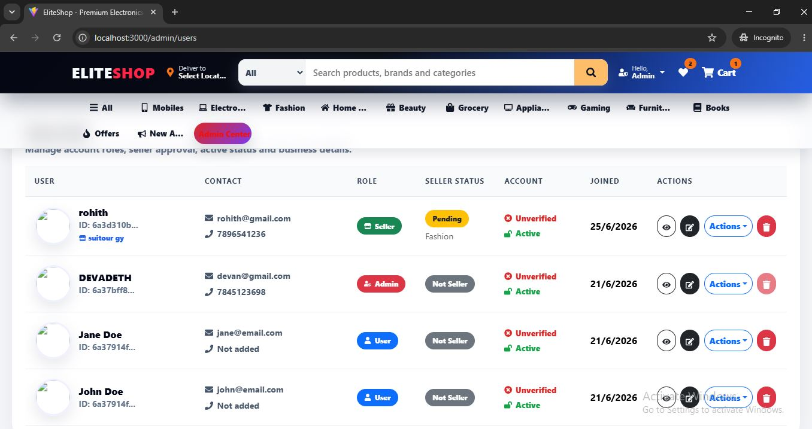

### Admin Approving Pending Seller


### Footer

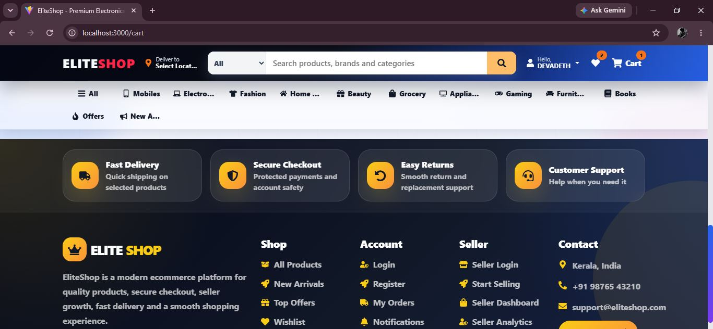

---

## Project Overview

EliteShop is designed with three main user roles:

* Customer
* Seller
* Admin

Customers can browse products, add items to cart, manage wishlist, place orders, and track order status.

Sellers can register, wait for admin approval, add products, upload product images, manage their products, and view seller-related orders.

Admins can manage users, sellers, products, approvals, orders, and platform activities from a dedicated admin dashboard.

---

## Key Features

### Customer Features

* Customer registration and login
* Product browsing by category
* Product details page
* Add to cart
* Wishlist management
* Shipping address flow
* Checkout process
* Order placement
* Razorpay payment flow
* My Orders page
* Order details and tracking

### Seller Features

* Seller registration
* Seller login
* Seller pending approval page
* Seller dashboard
* Add product
* Edit product
* Delete product
* Upload product images
* View seller analytics
* Manage seller products

### Admin Features

* Admin dashboard
* User management
* Seller management
* Seller approval and rejection
* Product management
* Order management
* Low stock monitoring
* Role-based access control
* Protected admin routes

### Product and Image Features

* Product categories
* Product details
* Product cards
* Product filtering and sorting
* Product image upload
* Cloudinary image storage
* Product image seeding from local folders
* Automatic product image update script

### Order and Payment Features

* Cart management
* Checkout steps
* Shipping details
* Order placement
* Razorpay integration
* Order status update
* Admin order management
* Seller order workflow

---

## Tech Stack

### Frontend

* React
* Vite
* React Router DOM
* React Bootstrap
* CSS
* Axios
* Framer Motion
* React Icons
* React Toastify
* Context API

### Backend

* Node.js
* Express.js
* MongoDB
* Mongoose
* JWT Authentication
* bcrypt.js
* Cloudinary
* Multer
* Razorpay
* dotenv
* cookie-parser
* cors

### Database

* MongoDB
* Mongoose Models

### Image Storage

* Cloudinary

### Payment Gateway

* Razorpay

---

## Folder Structure

```txt
ecomerse
├── assets
│   └── screenshots
│       ├── admin dashboard.jpg
│       ├── admin- aproving-pending-seller.jpg
│       ├── admin-1.jpg
│       ├── admin-2.jpg
│       ├── admin-3.jpg
│       ├── admin-4.jpg
│       ├── admin-aproved-seller.jpg
│       ├── admin-aproving-seller.jpg
│       ├── cart-page-1.jpg
│       ├── cart-page-2.jpg
│       ├── footer.jpg
│       ├── home.jpg
│       ├── product.jpg
│       ├── seller approval pending.jpg
│       ├── seller.jpg
│       ├── seller1.jpg
│       ├── seller2.jpg
│       └── user-dasboard.jpg
│
├── backend
│   ├── config
│   │   ├── cloudinary.js
│   │   └── db.js
│   │
│   ├── controllers
│   │   ├── cartController.js
│   │   ├── orderController.js
│   │   ├── productController.js
│   │   └── userController.js
│   │
│   ├── data
│   │   ├── sampleProducts.js
│   │   └── users.js
│   │
│   ├── middleware
│   │   ├── asyncHandler.js
│   │   ├── authMiddleware.js
│   │   ├── checkObjectId.js
│   │   ├── errorMiddleware.js
│   │   └── uploadMiddleware.js
│   │
│   ├── models
│   │   ├── cartModel.js
│   │   ├── orderModel.js
│   │   ├── productModel.js
│   │   └── userModel.js
│   │
│   ├── routes
│   │   ├── cartRoutes.js
│   │   ├── orderRoutes.js
│   │   ├── productRoutes.js
│   │   ├── uploadRoutes.js
│   │   └── userRoutes.js
│   │
│   ├── scripts
│   │   ├── createAdmin.js
│   │   └── uploadProductImages.js
│   │
│   ├── utils
│   │   ├── calcPrices.js
│   │   ├── generateToken.js
│   │   └── razorpay.js
│   │
│   ├── seeder.js
│   └── server.js
│
├── frontend
│   ├── src
│   │   ├── components
│   │   ├── context
│   │   ├── pages
│   │   ├── styles
│   │   ├── utils
│   │   ├── App.jsx
│   │   └── main.jsx
│   │
│   ├── index.html
│   ├── package.json
│   └── vite.config.js
│
├── .gitignore
└── README.md
```

---

## Environment Variables

Create a `.env` file inside the `backend` folder.

```env
PORT=5000
NODE_ENV=development
MONGO_URI=your_mongodb_connection_string
JWT_SECRET=your_jwt_secret

CLOUDINARY_CLOUD_NAME=your_cloudinary_cloud_name
CLOUDINARY_API_KEY=your_cloudinary_api_key
CLOUDINARY_API_SECRET=your_cloudinary_api_secret

RAZORPAY_KEY_ID=your_razorpay_key_id
RAZORPAY_KEY_SECRET=your_razorpay_key_secret
```

Create a `.env` file inside the `frontend` folder.

```env
VITE_API_URL=http://localhost:5000/api
VITE_RAZORPAY_KEY_ID=your_razorpay_key_id
```

Important: real `.env` files are ignored using `.gitignore` and should not be pushed to GitHub.

---

## Installation and Setup

### 1. Clone the Repository

```bash
git clone https://github.com/abhijithak04/eliteshop.git
cd eliteshop
```

### 2. Backend Setup

```bash
cd backend
npm install
npm start
```

Backend runs on:

```txt
http://localhost:5000
```

### 3. Frontend Setup

```bash
cd frontend
npm install
npm run dev
```

Frontend runs on:

```txt
http://localhost:3000
```

---

## Database Seeding

To insert sample users and products:

```bash
cd backend
node seeder.js
```

To insert only products:

```bash
node seeder.js --products
```

To delete seeded data:

```bash
node seeder.js -d
```

---

## Cloudinary Product Image Upload

Product images are uploaded to Cloudinary using a backend script.

```bash
cd backend
node scripts/uploadProductImages.js
```

The script checks product images from:

```txt
backend/seed-images/products
backend/seed-images/categories
```

Exact product images should be placed inside:

```txt
backend/seed-images/products
```

Category fallback images should be placed inside:

```txt
backend/seed-images/categories
```

---

## Main Application Workflows

### Customer Workflow

```txt
Register/Login
→ Browse Products
→ View Product Details
→ Add to Cart
→ Add to Wishlist
→ Checkout
→ Place Order
→ Pay Using Razorpay
→ Track Order
```

### Seller Workflow

```txt
Seller Register
→ Wait for Admin Approval
→ Login as Seller
→ Add Product
→ Upload Product Image
→ Manage Products
→ View Orders
```

### Admin Workflow

```txt
Admin Login
→ View Dashboard
→ Manage Users
→ Manage Sellers
→ Approve/Reject Sellers
→ Manage Products
→ Manage Orders
→ Update Order Status
```

---

## API Modules

The backend is divided into clear API modules:

* User authentication and profile APIs
* Product APIs
* Cart APIs
* Order APIs
* Upload APIs
* Seller-related APIs
* Admin management APIs

---

## Security Features

* JWT-based authentication
* Protected routes
* Role-based access control
* Password hashing with bcrypt.js
* Environment variables for secrets
* Secure backend configuration
* Admin-only and seller-only route protection
* Sensitive files ignored using `.gitignore`

---

## Project Highlights

* Built complete MERN ecommerce workflow
* Implemented customer, seller, and admin role system
* Added Cloudinary product image upload and management
* Integrated Razorpay payment gateway
* Created MongoDB models for users, products, carts, and orders
* Built protected frontend routes
* Added responsive UI using React Bootstrap and custom CSS
* Created product seeding and image upload automation scripts
* Designed dashboards for admin and seller workflows

---

## What I Learned

* Full-stack MERN application development
* REST API development using Express.js
* MongoDB schema design with Mongoose
* Authentication and authorization using JWT
* Role-based routing in React
* Context API for cart, wishlist, and auth state
* Cloudinary image upload integration
* Razorpay payment integration
* Admin and seller dashboard workflows
* GitHub project organization and deployment preparation

---

## Future Improvements

* Add email notifications
* Add invoice PDF generation
* Add advanced seller analytics
* Add coupon management
* Add product review image uploads
* Add search suggestions
* Add recommendation system
* Add custom domain after deployment
* Improve SEO and performance optimization

---

## Author

Abhijith Kumar p a
MERN Stack Developer

GitHub: [abhijithak04](https://github.com/abhijithak04)
